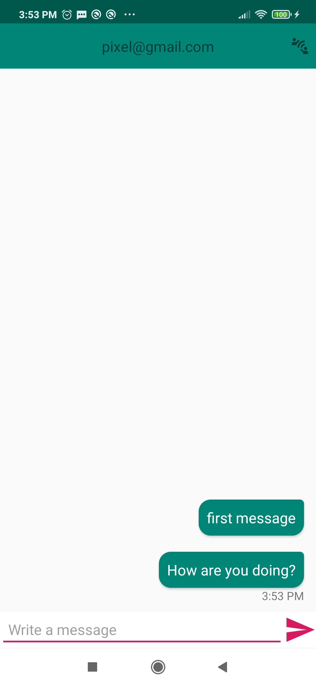
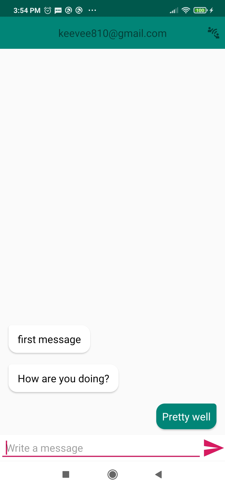

# EncChat
An end-to-end encrypted chat application for Android. Built using a Firebase server.




## Features
- Supports text-based encrypted chat between two-users
- Notifications for chat messages
- Profile page with public key displayed
- Challenge-response notifications within a chat

## Installation
EncChat requires users to have an Android device running Android 5.0 or higher.
Turn on Developer Options and USB Debugging on your Android device and connect it to your computer.

To run EncChat, download an IDE, such as [Android Studio](https://developer.android.com/studio#downloads) (available for Windows, MacOS, Linux).
Select the appropriate package based on your OS, and follow the install instructions.

Open EncChat using Android Studio (File > Open).
In the toolbar, select the connected Android device, and press the green Run button. 

## Contributing
### Firebase
To begin contributing, you will need access to Firebase, which acts as the server and database for the project.

[Firebase Link]https://console.firebase.google.com/project/encchat-506da/overview)

To request access, send an email to keevee810@gmail.com

### Cloud Functions
To expand on notifications, you will need to download Node.js (https://nodejs.org/en/download/)

To add cloud new cloud functions, edit the index.ts file.

To deploy functions to firebase, open a command prompt. Then, login to firebase.
```sh
firebase login
```

Then, deploy the functions to the server.
```sh
firebase deploy
```